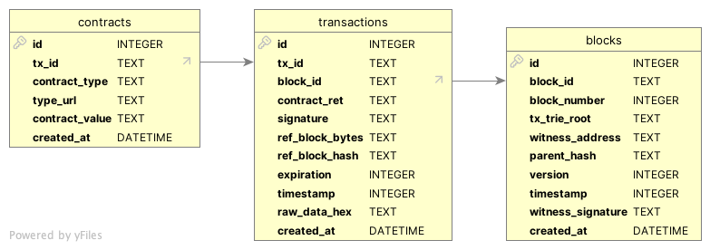

# Simple script to get the TRON blocks

A GOlang application that monitor and stores TRON blockchain data from the Shasta.

## Features

- Real-time Block Monitoring: Fetches new blocks every 10 seconds
- Data Storage: Stores block data in SQLite database with proper relationships
- Transaction Processing: Captures all transactions within each block

## Database Schema 

Blocks ->

- Block ID, number, timestamp
- Witness information
- Parent hash and version

transactions ->

- Transaction ID and signatures
- Links to parent block
- Execution results and raw data

contracts ->

- Smart contract details
- Contract types and parameters
- Links to parent transaction

## How It Works

1. API Connection: Connects to TRON Shasta testnet API endpoint
2. Data Fetching: Makes POST requests to get current block data
3. JSON Parsing: Unmarshals API response using defined DTOs
4. Database Storage: Saves structured data with foreign key relationships
5. Continuous Monitoring: Repeats process every 10 seconds

## Key Functions

- `getNowBlock()`: Fetches latest block from TRON API
- `saveBlockData()`: Parses and stores block data in database
- `createTables()`: Sets up database schema
- `StartBlockMonitoring()`: Runs continuous monitoring loop
